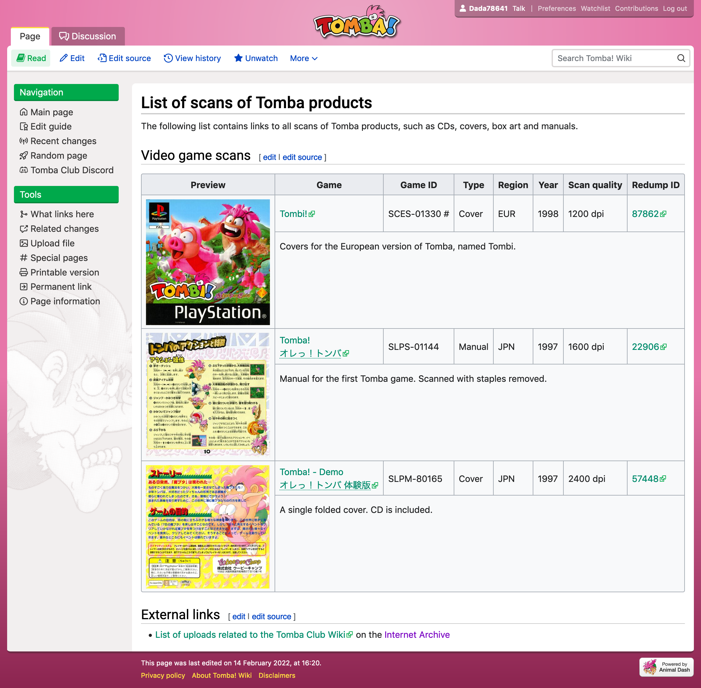

[](https://opensource.org/licenses/MIT)

# Tomba Club Mediawiki Skin

A Mediawiki skin made for the Tomba Club wiki (v2). This skin is purely a set of CSS changes (done in SCSS) to the existing Vector skin.

## Example

Here's what it looks like:



This image might be a bit outdated since this skin will continue to be updated over time.

## Installation

Upload the files somewhere, and then add them as custom stylesheets/scripts in `LocalSettings.php`:

```php
function tombaClubWikiSkin(&$out, &$skin) {
  $out->addStyle('/resources/design/tomba-club-vector-v2/tomba-club-vector.css');
  $out->addScriptFile('/resources/design/tomba-club-vector-v2/tomba-club-vector.js');
}

// Add the customizer function to the hooks.
$wgHooks['BeforePageDisplay'][] = 'tombaClubWikiSkin';

// Also add the custom footer image:
$wgFooterIcons['poweredby']['mediawiki'] = [
  'src' => '/resources/design/tomba-club-vector-v2/images/powered-by.png',
  'url' => 'https://www.mediawiki.org/',
  'alt' => "Powered by Animal Dash",
];
```

Building the CSS requires [SassC 1.43.1](https://sass-lang.com/install) (although probably most other recent versions will work).

### Required hack

Vector has a feature where if there's too many tabs in the right navigation, they get collapsed under a "more" menu. This is called "tab collapse". This needs to be hacked out for the Tomba Club skin since the left and right navigation are both left-aligned now, and it mistakenly detects this as there being no space at all.

To do this, edit `mediawiki/skins/Vector/resources/skins.vector.legacy.js/vector.js` and comment out the entire latter half (from `$tabContainer.on('beforeTabCollapse', ..` to the end); see the `hacks` directory in this repository for an example.

## License

MIT license
