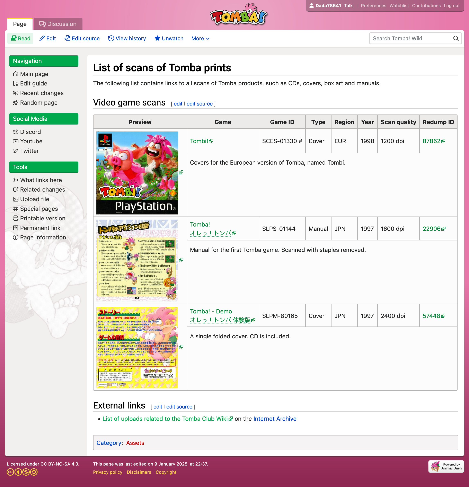

[](https://opensource.org/licenses/MIT)

# Tomba Club MediaWiki Skin

A MediaWiki skin and extension made for the Tomba Club wiki. This skin is implemented as a set of CSS changes (done in SCSS) to the existing [Vector skin](https://www.mediawiki.org/wiki/Skin:Vector).

The skin is activated through the use of a custom extension, which also adds various other customizations.

## Design

Here's what it looks like:



## Installation

Install the `TombaClub` extension and activate it using your `LocalSettings.php`:

```php
wfLoadExtension('TombaClub');
```

Various resources like the logo and favicon are added automatically by the extension.

### Required hack

The Vector skin has a feature where if there's too many tabs in the right navigation, they get collapsed under a "more" menu. This is called "tab collapse". This needs to be hacked out for the Tomba Club skin since the left and right navigation are both left-aligned now, and it mistakenly detects this as there being no space at all. There is no way to turn this feature off without editing the file directly.

To do this, edit `mediawiki/skins/Vector/resources/skins.vector.legacy.js/vector.js` and comment out the entire latter half (from `$tabContainer.on('beforeTabCollapse', ..` to the end); see the `resources/hacks` directory in this repository for an example.

## Development

Building the CSS requires [SassC 1.43.1](https://sass-lang.com/install) or up.


## License

MIT license
